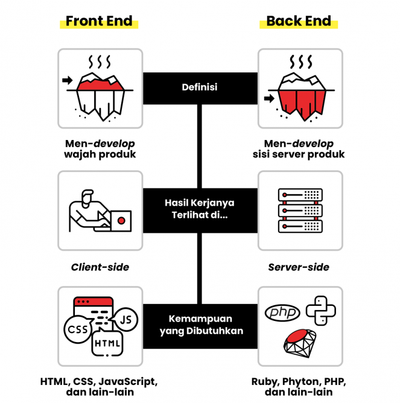

# Node JS

Class: JavaScript
Created: Dec 12, 2020 10:25 AM
Reviewed: Yes
Type: Backend

# Materi Javascript



**Basic Front End**

1. HTML
2. CSS
3. JAVASCRIPT

Apa itu Front End ?

Pada prinsipnya, front end bekerja untuk memastikan agar situs atau aplikasi dapat dilihat oleh pengguna. Mereka bertanggung jawab agar pengguna dapat mendapatkan informasi sampai berinteraksi dengan situs atau web secara nyaman.

Bagaimana cara kerjanya ?

**Basic Back End**

1. MYSQL
2. NODE JS

Apa itu Back End ?

Bagaimana cara kerjanya ?

# Praktek

## Bahan-bahan yang diperlukan

- [ ]  code editor
- [ ]  access internet
- [ ]  node js
- [ ]  npm
- [ ]  express js
- [ ]  mysql
- [ ]  method-override
- [ ]  ejs

Hari ini kita akan mempraktekkan bagaimana 

### Step by step

1. membuat folder **project** *mkdir namaProject*
2. inisialisasi node

    ```jsx
    npm init
    ```

3. install package 
    - npm install
        - [ ]  express
        - [ ]  mysql
        - [ ]  method-override
        - [ ]  ejs
        - [ ]  nodemon
        - [ ]  dotenv
4. buat lah file server.js

    ```jsx
    const express = require('express');
    const app = express()
    var methodOverride = require("method-override")
    const koneksi = require("./config/db.js")

    //menghubungkan dengan templating engine
    app.set('view engine', 'ejs');

    // koneksi ke database
    app.use(function(req,res,next){
    req.koneksi = koneksi
    next()
    })

    // parsing body request atau ngirim data
    app.use(express.json())
    app.use(express.urlencoded({
        extended: true
    }))
    app.use(methodOverride("_method"))

    // menghubungkan dengan routing
    const artikelRouter = require("./router/artikelRouter")
    app.use('/artikel',artikelRouter);

    app.listen(5000, () => {
        console.log(`Server terhubung`);
    });
    ```

5. edit file package.json 

    ```jsx
    "scripts": {
        "dev" : "nodemon server.js",
    		"start" : "node server.js"
      },
    ```

6. buat structure MVC

    1. buat folder views
        1. layouts
            1. index.ejs

                ```html
                <!DOCTYPE html>
                <html lang="en">
                <head>
                    <meta charset="UTF-8">
                    <meta name="viewport" content="width=device-width, initial-scale=1.0">
                    <title>Home</title>
                    <link rel="stylesheet" href="https://maxcdn.bootstrapcdn.com/bootstrap/4.0.0/css/bootstrap.min.css" integrity="sha384-Gn5384xqQ1aoWXA+058RXPxPg6fy4IWvTNh0E263XmFcJlSAwiGgFAW/dAiS6JXm" crossorigin="anonymous">
                </head>
                <body>
                  <div class="container">
                      <h1 class="display-3 mb-3 mt-4">Artikel</h1>
                      <a href="artikel/tambah" class="btn btn-success">Tambah</a>
                      <div class="row mt-4">
                        <% data.forEach(row => { %> 
                        <div class="col-sm-6">
                          <div class="card mb-4">
                            <div class="card-body">
                              <h5 class="card-title"><%= row.judul %> </h5>
                              <p class="card-text"><%= row.konten %> </p>           
                              <p class="text-muted">Author : <%= row.author %> </p>                     
                              <a href="/artikel/edit/<%= row.id %>"  class="btn btn-primary">Edit</a> 
                              <form action="/artikel/<%= row.id %>?_method=DELETE" method="POST" class="d-inline">
                                <button class="btn btn-danger" type="submit">Hapus</button>
                              </form>             
                            </div>
                          </div>
                        </div>
                        <% }) %> 
                      </div>
                  </div>
                </body>
                </html>
                ```

            2. tambah.ejs

                ```jsx
                <!DOCTYPE html>
                <html lang="en">
                <head>
                    <meta charset="UTF-8">
                    <meta name="viewport" content="width=device-width, initial-scale=1.0">
                    <title>Home</title>
                    <link rel="stylesheet" href="https://maxcdn.bootstrapcdn.com/bootstrap/4.0.0/css/bootstrap.min.css" integrity="sha384-Gn5384xqQ1aoWXA+058RXPxPg6fy4IWvTNh0E263XmFcJlSAwiGgFAW/dAiS6JXm" crossorigin="anonymous">
                </head>
                <body>
                  <div class="container">
                      <h1 class="display-3 mb-3 mt-4">Nambah Artikel</h1>
                      <form action="/artikel" method="POST">
                        <!-- terhubung dengan form-fields -->
                        <%- include('_form_fields') %> 
                      </form>      
                  </div>
                </body>
                </html>
                ```

            3. _form_fields.ejs

                ```jsx
                <div class="row">
                    <div class="form-froup col-sm-6">
                        <label for="judul">Judul</label>
                        <input type="text" name="judul" class="form-control" required>    
                    </div>
                    <div class="form-froup col-sm-6">
                        <label for="author">Author</label>
                        <input type="text" name="author" class="form-control" required>    
                    </div>
                    <div class="form-froup col-sm-12">
                        <label for="konten">Konten</label>
                        <input type="text" name="konten" class="form-control" required>    
                    </div>
                </div><br>
                <a href="/artikel" class="btn btn-secondary">Cancel</a>
                <button type="submit" class="btn btn-primary">Tambah</button>
                ```

            4. edit.ejs

                ```jsx
                <!DOCTYPE html>
                <html lang="en">
                <head>
                    <meta charset="UTF-8">
                    <meta name="viewport" content="width=device-width, initial-scale=1.0">
                    <title>Edit</title>
                    <link rel="stylesheet" href="https://maxcdn.bootstrapcdn.com/bootstrap/4.0.0/css/bootstrap.min.css" integrity="sha384-Gn5384xqQ1aoWXA+058RXPxPg6fy4IWvTNh0E263XmFcJlSAwiGgFAW/dAiS6JXm" crossorigin="anonymous">
                </head>
                <body>
                  <div class="container">
                      <h1 class="display-3 mb-3 mt-4">Edit Artikel</h1>
                      <form action="/artikel/<%= data.id %>?_method=PUT " method="POST">
                       <div class="row">
                    <div class="form-froup col-sm-6">
                        <label for="judul">Judul</label>
                        <input type="text" name="judul" class="form-control" value="<%= data.judul %>">    
                    </div>
                    <div class="form-froup col-sm-6">
                        <label for="author">Author</label>
                        <input type="text" name="author" class="form-control" value="<%= data.author %>">    
                    </div>
                    <div class="form-froup col-sm-12">
                        <label for="konten">Konten</label>
                        <input type="text" name="konten" class="form-control" value="<%= data.konten %>">    
                    </div>
                </div><br>
                <a href="/artikel" class="btn btn-secondary">Cancel</a>
                <button type="submit" class="btn btn-primary">Tambah</button>

                      </form>      
                  </div>
                </body>
                </html>
                ```

    2. buat folder router 
        1. artikelRouter.js

        ```jsx
        const express = require('express');
        const router = express.Router();
        const artikelController = require("../controller/artikelController")

        router.get('/',artikelController.index)
        router.get('/tambah',artikelController.create)
        router.post('/',artikelController.store)
        router.get('/edit/:id',artikelController.edit)
        router.put('/:id',artikelController.update);
        router.delete('/:id',artikelController.delete);

        module.exports = router
        ```

    3. buat folder controller
        1. artikelController.js

        ```jsx
        const Artikel = require('../models/Artikel')

        module.exports = {
            index: function(req,res){
                Artikel.get(req.koneksi,function(err,rows){
               res.render('layouts/index',{data:rows});
                })
            },
            create: function(req,res){
                res.render('layouts/tambah');
            },
            store: function(req,res){
                Artikel.create(req.koneksi,req.body,function(err){
                     res.redirect('/artikel');
                })
            },
            edit:function(req,res){
                Artikel.getById(req.koneksi, req.params.id, function(err,rows){
                    res.render("layouts/edit",{data:rows[0]})
                })
            },
            update:function(req,res){
                Artikel.update(req.koneksi, req.body, req.params.id,function(err){
                    res.redirect('/artikel');
                })
            },
            delete: function(req,res){
                Artikel.delete(req.koneksi,req.params.id,function(err){
                     res.redirect('/artikel');
                })
            }
        }
        ```

    4. buat folder models
        1. Artikel.js

        ```jsx
        module.exports = {
            // untuk mendapatkan semua data
            get: function(koneksi, callback){
                koneksi.query("SELECT * FROM artikel",callback)
            },

            // edit data ambil dengan spesifik
            getById: function(koneksi,id,callback){
                koneksi.query(`SELECT * FROM artikel WHERE id = ${id}`,callback)
            },

            // untuk menambah semua data    
            create: function (koneksi, data, callback) {
                koneksi.query(
                    `INSERT INTO artikel SET 
                    judul = '${data.judul}',
                    author = '${data.author}',
                    konten = '${data.konten}'`,
                    callback
                )
            },

            // update
            update: function(koneksi,data,id,callback){
                koneksi.query(
                    `UPDATE artikel SET
                    judul = '${data.judul}',
                    author = '${data.author}',
                    konten = '${data.konten}'
                    WHERE id = ${id}`,callback
                )
            },

            // delete
            delete: function(koneksi,id,callback){
                koneksi.query(
                    `DELETE FROM artikel WHERE id = ${id}`,callback
                )
            }

        }
        ```

    5. buat folder config
        1. db.js

        ```jsx
        const mysql = require("mysql")
        require("dotenv").config()

        module.exports = mysql.createConnection({
            host: process.env.DB_HOST,
            user: process.env.DB_USER,
            password: process.env.DB_PASS,
            database: process.env.DB_NAME
        })
        ```
    6. silahkan buat file .env untuk menghubungkan dengan database mysql kita
        1. .env
        ```jsx
        DB_HOST = localhost
        DB_USER = root
        DB_PASS = 
        DB_NAME = artikel
        ```

    7. silahkan buat database di mysql dengan nama ```artikel``` ,dengan format kolom seperti dibawah
        ```sqlx
 
            CREATE TABLE `artikel` (
            `id` bigint(20) unsigned NOT NULL AUTO_INCREMENT,
            `judul` varchar(50) NOT NULL,
            `konten` varchar(50) NOT NULL,
            `author` varchar(50) NOT NULL,
            PRIMARY KEY (`id`),
            UNIQUE KEY `id` (`id`)
            ) ENGINE=InnoDB AUTO_INCREMENT=5 DEFAULT CHARSET=utf8;

        ```
